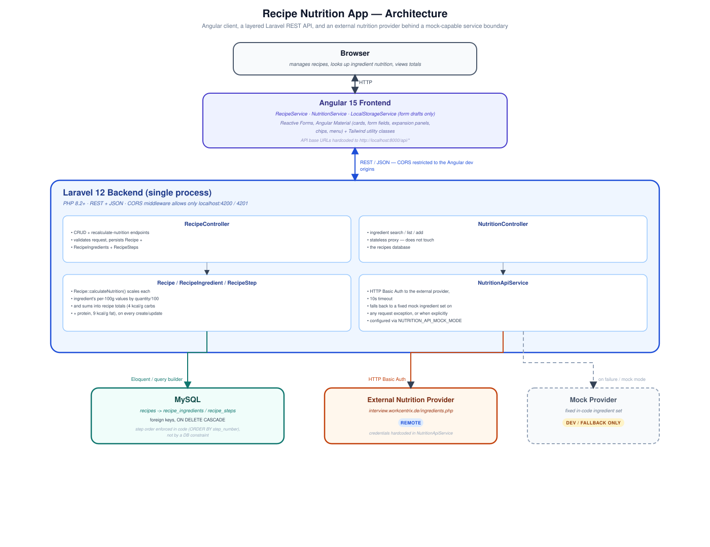
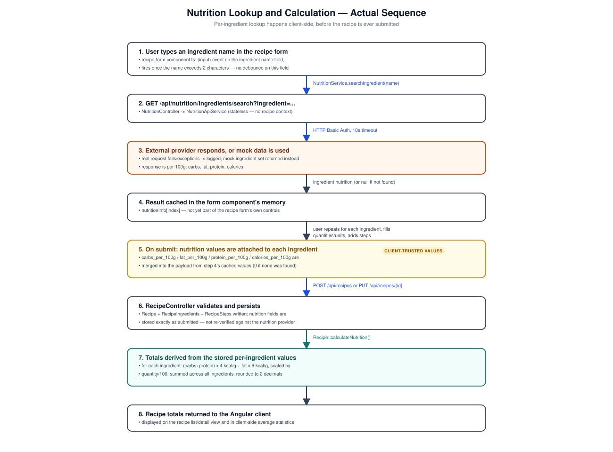

# Recipe Nutrition App

A full-stack recipe management application: a Laravel REST API persists recipes as relational records (ingredients with quantities and units, ordered preparation steps), while an Angular client looks up per-ingredient nutrition data from an external provider and lets the backend derive recipe-level calorie and macronutrient totals from that data.

## Engineering Highlights

- **Relational recipe modeling.** A recipe is not a serialized blob — `Recipe`, `RecipeIngredient`, and `RecipeStep` are separate tables with foreign keys and `ON DELETE CASCADE`, so ingredients and steps are queryable, individually validated records rather than JSON dumped into one column.
- **Nutrition totals are derived, not entered.** `Recipe::calculateNutrition()` recomputes `total_calories`/`total_carbs`/`total_fat`/`total_protein` from the recipe's current ingredients on every create and update (4 kcal/g for carbohydrates and protein, 9 kcal/g for fat, scaled by `quantity / 100`), rather than trusting a client-submitted total.
- **The external nutrition lookup is isolated in one service.** `NutritionApiService` is the only place that knows the external provider's URL, credentials, and response shape — controllers and the Angular client never talk to it directly.
- **A real, request-triggered fallback, not just a config flag.** Every method on `NutritionApiService` catches request exceptions and falls back to a fixed mock ingredient set automatically, in addition to the explicit `NUTRITION_API_MOCK_MODE` environment flag — see [External Nutrition Integration](#external-nutrition-integration).
- **Nutrition lookup happens client-side, before submission.** The Angular form looks up each ingredient's nutrition as it's typed and attaches the result to the payload before the recipe is ever sent to `POST /api/recipes` — a specific, verifiable sequence documented in [Nutrition Calculation Flow](#nutrition-calculation-flow).
- **Server-side request validation on every write.** `RecipeController` validates recipe, ingredient, and step fields via Laravel's `Validator` before touching the database, returning structured 422 responses with field-level errors on failure.
- **Auto-saving form state.** The recipe form persists its in-progress state to `localStorage` on a 1-second debounce and restores it on next visit (new-recipe flow only), independent of the actual recipe data path.

## Features

### Recipe Management

Create, edit, delete, list, and view individual recipes through `RecipeController`. Each recipe has a name, optional description, servings, and prep/cook time (minutes). There is no search, filtering, sorting, or pagination anywhere in the API or the recipe list UI — `GET /api/recipes` returns the full set every time.

### Ingredients & Cooking Steps

Ingredients and steps are added and removed dynamically in the recipe form (Angular `FormArray`), each requiring at least one entry. An ingredient has a name, a decimal quantity, and a unit (free-text string — there is no unit conversion; `g`, `ml`, `cups`, etc. are all stored and used identically as "per 100 of whatever unit was entered"). Steps are explicitly ordered: `RecipeStep.step_number` is assigned from the step's position in the form on submit (`index + 1`), and `Recipe::steps()` always queries with `orderBy('step_number')`. That ordering is enforced by application code, not a database constraint — there's no unique index on `(recipe_id, step_number)`.

### Nutrition Calculation

Four metrics are calculated: calories, carbohydrates, fat, and protein — all as recipe-level totals in `recipes.total_*` columns (`decimal(8,2)`). There is no fiber, sugar, sodium, cholesterol, or micronutrient tracking, and no per-serving breakdown (totals are for the whole recipe, not divided by `servings`). See [Nutrition Calculation Flow](#nutrition-calculation-flow) for exactly how a value gets from "user types an ingredient name" to a stored total.

### Dashboard / Statistics

The recipe list view shows two summary figures — average cooking time and average calories across the currently loaded recipes — computed entirely client-side (`Array.reduce` over the recipes array in `RecipeListComponent`), not returned by any API endpoint or aggregated in the database. Recipes with zero calories are excluded from the average-calories calculation.

### Sharing

Each recipe card can be shared via a generated WhatsApp link, a generated Facebook share link, or copied to the clipboard as formatted text (with a `document.execCommand('copy')` fallback for browsers without the Clipboard API). This is text-based sharing, not a persisted or authenticated share link.

## Architecture



The Angular client and Laravel API are two independently run processes talking over REST/JSON; there is no server-side rendering or shared process boundary. `RecipeController` owns the relational recipe data in MySQL. `NutritionController` is a stateless proxy — it never touches the recipes database — delegating to `NutritionApiService`, which talks to the external provider (or a mock provider) over HTTP. CORS is restricted by `App\Http\Middleware\Cors` to `http://localhost:4200` and `:4201`.

## Nutrition Calculation Flow



The nutrition lookup is not a step the backend performs while saving a recipe — it's a separate, earlier interaction the frontend orchestrates:

1. As the user types an ingredient name (past 2 characters), the form calls `NutritionService.searchIngredient()`.
2. That hits `GET /api/nutrition/ingredients/search`, a stateless call with no knowledge of any recipe — `NutritionController` delegates to `NutritionApiService`.
3. The external provider responds, or (on failure or explicit mock mode) a fixed mock ingredient is returned instead.
4. The result is cached in the form component's in-memory state, keyed by ingredient index.
5. On submit, those cached per-100g values (or `0` if a lookup never resolved) are merged into each ingredient in the outgoing payload.
6. `RecipeController` validates and persists the recipe with whatever nutrition values arrived in the request — **it does not re-query the nutrition provider or verify the submitted values**.
7. `Recipe::calculateNutrition()` derives the recipe's totals from those stored per-ingredient values.

The practical consequence: nutrition accuracy depends entirely on what the external provider (or mock data) returned when the ingredient was typed, and the backend trusts the numbers it receives rather than being the source of truth for them.

## External Nutrition Integration

`NutritionApiService` calls a single external endpoint (`ingredients.php`, on a third-party host used for this project's nutrition data) with HTTP Basic Auth and a 10-second timeout, using Guzzle via Laravel's `Http` facade. Three operations are supported: list all ingredients, search by name, and add a new ingredient — each returns nutrition per 100g (carbohydrates, fat, protein, calories).

Two independent paths lead to mock data:
- **Explicit**: `NUTRITION_API_MOCK_MODE=true` in `.env`, or running with `APP_ENV=testing`.
- **Automatic**: any exception during the HTTP call (timeout, connection failure, DNS error) is caught, logged, and followed by a fallback to the same fixed mock ingredient set — the caller receives usable data either way, with the fallback only visible in `storage/logs/laravel.log`.

The mock set is a fixed list of six ingredients (chicken breast, brown rice, broccoli, olive oil, and the two ingredients the original project brief specifically required — organic quinoa and Greek yogurt). This is a development/offline-testing convenience, not a production nutrition dataset — mock values are hardcoded approximations, not sourced from any nutrition authority.

```env
# .env — no .env.example is committed; these are the keys config/database.php
# and NutritionApiService expect
DB_CONNECTION=mysql
DB_HOST=127.0.0.1
DB_PORT=3306
DB_DATABASE=recipe_nutrition_app
DB_USERNAME=your_username
DB_PASSWORD=your_password
NUTRITION_API_MOCK_MODE=false
```

The external API's own credentials are hardcoded as private properties in `NutritionApiService`, not read from environment variables — there is nothing to place in `.env` for the external provider itself.

## Engineering Decisions

**Why nutrition logic lives in the backend.** `NutritionApiService` keeps the external provider's URL and credentials out of the browser, and keeps the kcal/g conversion and aggregation logic in one place (`Recipe::calculateNutrition()`) rather than duplicated in the Angular client.

**Why a mock provider exists.** It lets the application run and be demoed without a live connection to the external service, and is used automatically as a resilience fallback rather than only as an opt-in test mode.

**Why ingredients and steps are separate relational tables instead of JSON columns.** Storing `RecipeIngredient` and `RecipeStep` as their own tables with foreign keys means quantities, units, and step order are individually queryable and constrained by the schema (cascade delete), rather than requiring the application to parse and validate a blob on every read.

**Why the nutrition lookup happens client-side instead of during recipe save.** The trade-off is explicit in the code: it keeps `POST /api/recipes` a single, fast, synchronous write instead of one that fans out to an external HTTP call per ingredient — at the cost of the backend not being able to guarantee the nutrition values it stores actually came from the nutrition provider (see [Nutrition Calculation Flow](#nutrition-calculation-flow)).

## Testing Strategy

**Backend**: no `tests/` directory and no `phpunit.xml` are present in this repository — there is currently no automated backend test suite to run.

**Frontend**: five Jasmine/Karma spec files exist (`app.component`, `home`, `navigation`, `recipe-form`, `recipe-list`), each verifying only that the component instantiates without error (`expect(component).toBeTruthy()`), with `HttpClientTestingModule` and `RouterTestingModule` used to satisfy dependencies. None of them assert on form validation, the nutrition-lookup flow, or API request/response behavior.

## API Overview

No Swagger/OpenAPI is configured. Responses follow a consistent `{ success, data|message|errors }` JSON shape; validation failures return 422 with field errors, missing resources return 404.

| Method | Endpoint | Purpose |
|---|---|---|
| GET | `/api/recipes` | List all recipes with ingredients and steps |
| POST | `/api/recipes` | Create a recipe (validates, persists, calculates nutrition) |
| GET | `/api/recipes/{id}` | Get one recipe |
| PUT | `/api/recipes/{id}` | Update a recipe (replaces ingredients/steps if provided) |
| DELETE | `/api/recipes/{id}` | Delete a recipe (ingredients/steps cascade) |
| POST | `/api/recipes/recalculate-nutrition` | Recalculate nutrition totals for every recipe |
| POST | `/api/recipes/{id}/recalculate-nutrition` | Recalculate nutrition totals for one recipe |
| GET | `/api/nutrition/ingredients` | List ingredients from the nutrition provider (or mock data) |
| GET | `/api/nutrition/ingredients/search?ingredient=` | Look up nutrition for one ingredient by name |
| POST | `/api/nutrition/ingredients` | Add a new ingredient to the external provider |
| POST | `/api/nutrition/ingredients/submit-required` | Submits two predefined ingredients (quinoa, Greek yogurt) |

## Tech Stack

| Area | Technology |
|---|---|
| Backend | PHP 8.2+, Laravel 12 |
| Persistence | MySQL, Eloquent ORM |
| HTTP client | Guzzle (via Laravel's `Http` facade) |
| Frontend | Angular 15.2, TypeScript ~4.9 |
| UI components | Angular Material (cards, form fields, select, chips, expansion panels, menu, icon, spinner, toolbar) |
| Styling | Tailwind CSS is configured (custom color palette, wired through Angular's built-in Tailwind support) but templates are built mainly from custom component CSS and Angular Material, not Tailwind utility classes |
| Testing | Jasmine/Karma (frontend, smoke-level only); no backend test suite currently exists |
| Build | Composer, npm, Angular CLI |

## Project Structure

```text
Recipe-Nutrition-App/
├── app/
│   ├── Http/
│   │   ├── Controllers/Api/     # RecipeController, NutritionController
│   │   └── Middleware/Cors.php
│   ├── Models/                  # Recipe, RecipeIngredient, RecipeStep
│   └── Services/NutritionApiService.php
├── database/migrations/         # recipes, recipe_ingredients, recipe_steps
├── routes/api.php
├── bootstrap/app.php            # middleware/routing registration (Laravel 12 style)
└── recipe-frontend/
    └── src/app/
        ├── components/
        │   ├── home/             # static landing page
        │   ├── navigation/
        │   ├── recipe-form/      # create/edit, ingredient nutrition lookup, auto-save
        │   └── recipe-list/      # list, client-side stats, sharing
        ├── services/             # recipe.service.ts, nutrition.service.ts, local-storage.service.ts
        └── shared/material.module.ts
```

## Getting Started

### Backend

```bash
composer install
cp .env.example .env   # not committed — create manually if missing, see below
php artisan key:generate
php artisan migrate
php artisan serve      # http://localhost:8000
```

No `.env.example` is committed to this repository. At minimum, `.env` needs `APP_KEY` (via `key:generate`) and the `DB_*` variables shown in [External Nutrition Integration](#external-nutrition-integration); `DB_CONNECTION` defaults to `sqlite` if left unset.

### Frontend

```bash
cd recipe-frontend
npm install
npm start   # http://localhost:4200
```

The Angular services call `http://localhost:8000/api/*` directly (hardcoded, not environment-driven) — the backend must be running on port 8000 for the frontend to work.

### Production Build

```bash
cd recipe-frontend
npm run build   # outputs to recipe-frontend/dist/
```

`php artisan serve` is a development server; it is not a production deployment mechanism. There is no committed Docker configuration, CI pipeline, or deployment script in this repository — running this in production would require your own web server (Nginx/Apache + PHP-FPM) configuration, `composer install --no-dev --optimize-autoloader`, and serving the Angular `dist/` output separately or from the same origin.

## Limitations

- No authentication — every endpoint is open to anyone who can reach the API.
- No search, filtering, sorting, or pagination for recipes; the full list is always returned.
- Ingredient units are free-text strings with no normalization or conversion — nutrition math assumes every unit behaves like "per 100 of that unit," which is only meaningful for gram-based quantities.
- Nutrition accuracy depends on the external provider (or mock fallback) and on whatever an ingredient name happened to match at lookup time; the backend does not re-verify submitted nutrition values.
- No backend automated test suite.
- Step ordering is enforced by application code, not a database constraint.

## Future Improvements

- User accounts and authentication.
- Recipe search, filtering, and pagination.
- Recipe photo uploads.
- Meal planning and shopping-list generation.
- A backend test suite (feature tests for the API, unit tests for `Recipe::calculateNutrition()` and `NutritionApiService`'s fallback behavior).

## License

No `LICENSE` file is currently committed to this repository.
